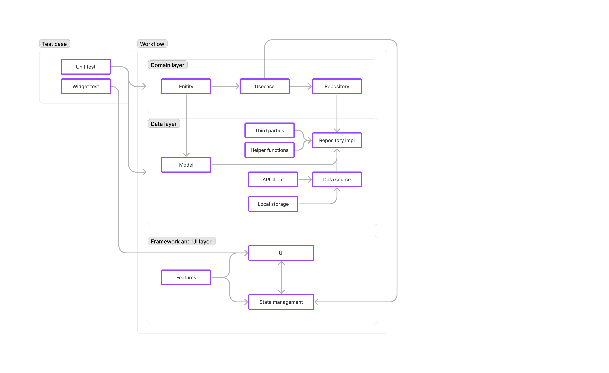

# Flutter Quick Care App

## Quick Care front-end project this is an application for shift-booking building with Flutter Framework.

### This project is equiped with:

- Flavors
- LightTheme and DarkTheme
- Routers (go_routers)
- Restful client (dio)
- Local storage (Shared_preferences)
- Dependencies control (get_it)
- Loggers

---

### Test method:

- Unit test
- Widget testing

---

### Explaining the architecture

Each layer is separated and connect by interfaces

1. Domain layer:
- Domain layer contains enterprise bussiness logic which responsible for abstracting use cases and bussiness enities.
- Presentation layer will comunicate domain layer use cases will be define first by bussiness rules
- Domain layer calls repositories (Abstract) and access to data source

2. Data layer:
- Data layer responsibles for fetching data and process data (Local source and Remote source)
- The repository folder of this layer is where the logic of fetching and process data reside. We will inject api client into those repository.

3. Presentation layer:
- Presentation layer responsibles for building the UI and handle UI logic
- Most of the applications logic will be here along side with state management flow
- There will be a state management sub-layer in this layer and the UI logic and calling Domain layer process will be there.

### Bloc architecture

In this project we are using ***Bloc (Cubit)*** as the main state management method.
With each feature we will attach with a Cubit and there will be a Cubit on top of the application.
